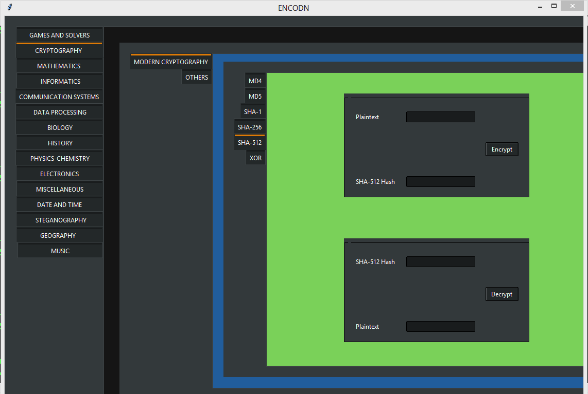

<!-- these reference variables' links are given at the end of the document-->
[![Contributors][contributors-shield]][contributors-url]
[![Forks][forks-shield]][forks-url]
[![Stargazers][stars-shield]][stars-url]
[![Issues][issues-shield]][issues-url]
[![MIT License][license-shield]][license-url]
[![LinkedIn][linkedin-shield]][linkedin-url]

# ENCODN

#### Desktop-App | Beginner-friendly | Easy-to-understand

This is perfect for new contributors who want to make **meaningful PR's** and are familiar with basic Python3. Please check the [contributing.md](contributing.md) file for rules and ideas about possible contributions.

##### About ENCODN:
This is a simple Python3 GUI based user interface whose original idea is based on [dcode.fr](https://dcode.fr/en/tools-list), you can refer to the link for an overview. The main frame has various tool options that open into a dropdown of more categories, as classified on dcode.fr, which lead you to fun encoder-decoder tools, game solving, puzzle solving, calculation based, cyphertext related basic as well as genome programming, image processing, live data manipulation related advanced tools.
The module used to implement this is Tkinter which is easy to learn. 

Below is a sample of the UI:

##### Repository Structure:
To avoid long messy codes we have broken up the GUI into directories of .py files as follows:
* Main window looping in ENCODN.py
* Structural frames in /FRAMES
* All buttons in /BUTTONS
* Various tools in /TOOLS where all categories have a different directory and divided into further sub-directories accordingly that eventually lead to two files:  (i) XYZ.py that contains a simple python program to execute the desired task, and (ii) XYZ-FRAME.py that contains the GUI part of the XYZ tool which uses the functionality of XYZ.py on command call. As you visit the directories, the structure will become clearer.

##### Live Demo:
Please check out the [LIVE DEMO](https://dsc-iiit-kalyani.github.io/ENCODN/) of ENCODN by clicking on this link, so you have an idea of what this Repository targets. Please feel free to contact the maintainers anytime for any type of query.

##### Basic Rules:
*Compulsory!! Do read [contributing.md](contributing.md) before submitting Pull Requests.*
* Create or pick an issue, it is important you clearly decide and inform what you will be working on. There are various issue templates provided, pick one according to your need. If none of them suits your purpose, choose a blank template instead.
* Create a branch for yourself and submit your PR. Make sure you add your labels, write proper descriptions of how the PR is contributing to the Repository, and link the issue assigned to you with it.
* **Only PRs with the label "hacktoberfest-accepted" will count towards your Hacktoberfest 2020 PR submissions.**
* **Spam PRs will be reported and meaningless PRs will not be merged/reviewed/considered by the maintainers**

##### Additional:
The code involves a basic notebook structure with vertical tab buttons. Each button is nested with a new Tkinter notebook for various sub-categories according to the division of categories on [dcode.fr](dcode.fr/en). Finally each tool/game has a separate folder with two files - one containing the GUI and the other containing the functions for the backend.

##### Owner:
This repository is owned by Developer Student Club IIIT Kalyani. You can reach out to us at dsc.iiitkalyani@gmail.com

<!-- MARKDOWN LINKS & IMAGES -->
<!-- https://www.markdownguide.org/basic-syntax/#reference-style-links -->
[contributors-shield]: https://img.shields.io/github/contributors/DSC-IIIT-Kalyani/ENCODN.svg?style=plastic
[contributors-url]: https://github.com/DSC-IIIT-Kalyani/ENCODN/graphs/contributors
[forks-shield]: https://img.shields.io/github/forks/DSC-IIIT-Kalyani/ENCODN.svg?style=plastic
[forks-url]: https://github.com/DSC-IIIT-Kalyani/ENCODN/network/members
[stars-shield]: https://img.shields.io/github/stars/DSC-IIIT-Kalyani/ENCODN.svg?style=plastic
[stars-url]: https://github.com/DSC-IIIT-Kalyani/ENCODN/stargazers
[issues-shield]: https://img.shields.io/github/issues/DSC-IIIT-Kalyani/ENCODN.svg?style=plastic
[issues-url]: https://github.com/DSC-IIIT-Kalyani/ENCODN/issues
[license-shield]: https://img.shields.io/badge/License-MIT-blue.svg?style=plastic
[license-url]: https://github.com/DSC-IIIT-Kalyani/ENCODN/blob/main/.github/LICENSE.md
[linkedin-shield]: https://img.shields.io/badge/-LinkedIn-black.svg?style=plastic&logo=linkedin&colorB=darkblue
[linkedin-url]: https://www.linkedin.com/in/akshitadixit/
